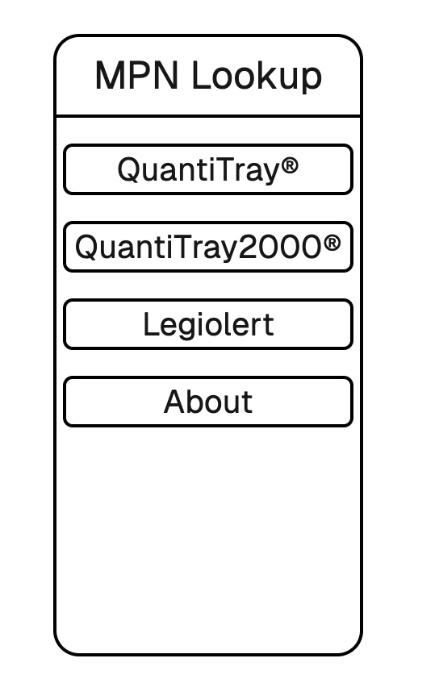
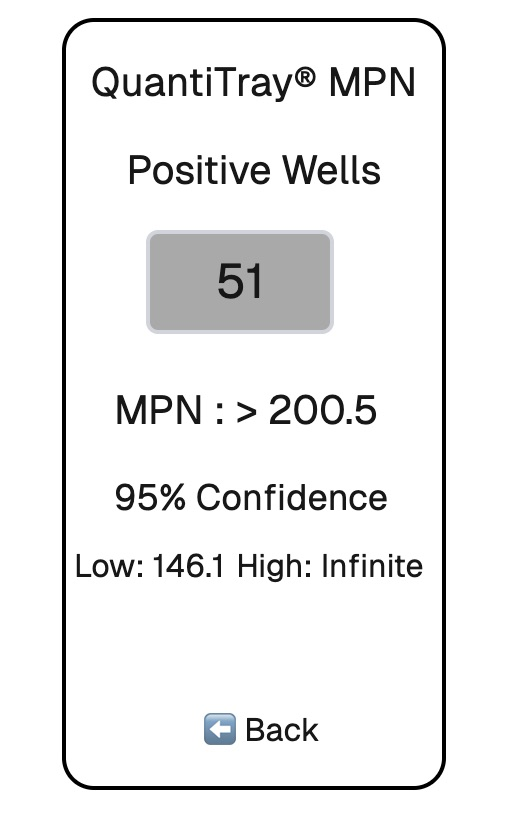

 
  

# MPN Lookup Demo  

## This is a test project to learn and practice Next.js and Tailwind CSS.

## It is a component that uses the [Mpn Lookup npm library](https://www.npmjs.com/package/mpn-lookup) which is simply a javascript object that contains the information in the PDF files located [here](https://www.idexx.com/files/qt97mpntable.pdf), [here](https://www.idexx.com/files/51-well-quanti-tray-mpn-table-h-en.pdf), and [here](https://www.idexx.com/files/quanti-tray-legiolert-mpn-table.pdf).

### Try it out:

#### 1. git clone https://github.com/jonathan-gartland/mpn-lookup-nextjs.git

#### 2. cd mpn-lookup-nextjs

#### 3. pnpm install

#### 4. pnpm run dev

#### the app should be running at http://localhost:3000

#### You should be seeing this view:

#### Once the server is running, (or go to the [github page](https://jonathan-gartland.github.io/mpn-lookup-nextjs)) you can enter a number of positive wells and the component will return the most probable number.

That's it.

#### The view including the MPN and confidence range after entering a positive well count of 51 for the QuantiTray

#### You may be thinking, this is very sparse - not much more than a wireframe.

#### I agree, feel free to fork and style it up.  
  

# License

This application is released under the [MIT license](LICENSE). You can use the code for any purpose, including commercial projects.

